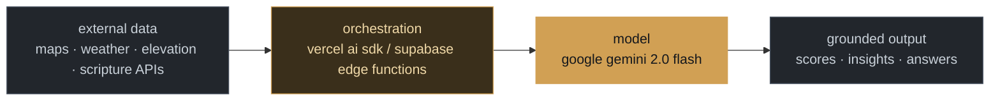

`ayesha-arbi ~ % whoami`

**Ayesha Zahid** — software engineering student building applied AI systems: a multi-agent land-analysis engine, a Gemini-grounded Q&A app, a browser extension with real users. Ships most of it under MIT. Pakistan.

```toml
# stack.manifest.toml
# confidence-tagged from actual repos, not aspiration.
# core       -> foundation of more than one shipped project
# applied    -> used in one real, working system (not a toy import)
# declared   -> on my own badge row, not yet corroborated here

[languages]
core     = ["typescript", "javascript", "python"]
applied  = ["c++"]                      # assignment/greedy algorithm in MiniJira

[frontend]
core     = ["next.js (app router)", "react"]
applied  = ["react-native / expo", "chrome-extension (manifest-v3)"]
support  = ["recharts", "lucide-react", "css-variables design system"]

[backend]
applied  = ["next.js api routes", "supabase edge-functions (deno)"]

[data]
applied  = ["supabase / postgres"]

[ai_generative]
core     = ["google gemini api", "vercel ai sdk"]
shipped  = [
  "multi-agent scoring pipeline   -> zameendar.ai",
  "retrieval-grounded q&a         -> askquran (gemini + quran.foundation api)",
]

[integrations]
applied  = ["google maps / leaflet", "open-meteo", "open-elevation", "nominatim (osm)", "tavily ai search"]

[infra_deploy]
core     = ["vercel"]
applied  = ["netlify", "supabase"]

[research_adjacent]
applied  = ["data structures & algorithms — assignment/greedy problems"]

[declared]
# on ayesha-arbi/ayesha-arbi's badge row; not corroborated in the
# repos inspected for this manifest — likely real, just unverified here.
note     = ["c#", ".net", "winforms/wpf", "sql", "github-actions", "postman", "figma"]
```

## how the AI pieces actually fit together

The shape below is the real pattern behind both `zameendar.ai`'s scoring engine and `AskQuran`'s answer pipeline — not a generic "AI stack" diagram.



Everything gets grounded in real external data before the model touches it — that's the one habit that shows up in both projects.

---

`Pull Shark` · open to interesting problems · [LinkedIn](https://www.linkedin.com/in/ayeshaarbi7/)
